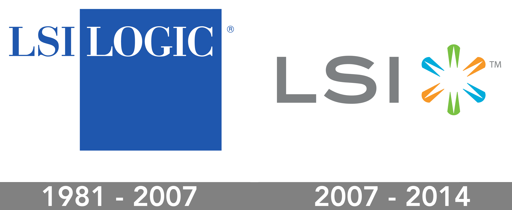

# LSI Logic MPT Configuration Utility
LSIUtil is a powerful configuration utility for LSI Logic MPT Host Bus Adapters (HBAs).
You can use LSIUtil with all Fibre Channel, SAS/SATA, and SCSI controllers based on LSI Logic chipsets.

LSIUtil enables you to perform tasks such as updating board firmware, scanning for connected devices, viewing configuration page information, running diagnostic tests, and displaying current system events and statistics.

**LSI Logic devices supported:**
- All LSI MPT Fusion SCSI chips and HBAs.
- All LSI Fibre Channel chips and HBAs.
- All LSI SAS chips and HBAs.


**LSIUtil features:**
- Identifies and updates the firmware or BIOS images. 
- Allows Flash to be completely erased.
- Allows configuration of all HBA and firmware parameters.
- Provides system level debug tools. 
- Supports command line execution.

You can run LSIUtil in text-based, menu-driven mode or in full-featured command line mode.

## Interactive operation:
The main window provides a selection of chip/HBA ports. Dual channel cards will have two entries (chips) displayed on this screen. Since both channels of a dual channel board share a flash part, only one of the paths needs to be chosen. However, no harm will be done if separate updates are done through both. This screen appears as:

```
root@linux:~/LSIUtil/release/LSIUtil_v1.72_binaries/Linux# ./lsiutil

LSI Logic MPT Configuration Utility, Version 1.72, Sep 09, 2014

1 MPT Port found

     Port Name         Chip Vendor/Type/Rev    MPT Rev  Firmware Rev  IOC
 1.  /proc/mpt/ioc0    LSI Logic SAS1068E B3     105      01172b00     0

Select a device:  [1-1 or 0 to quit] 1

 1.  Identify firmware, BIOS, and/or FCode
 2.  Download firmware (update the FLASH)
 4.  Download/erase BIOS and/or FCode (update the FLASH)
 8.  Scan for devices
 801.  Scan for 1 LUN
 810.  Scan for 10 LUN's
10.  Change IOC settings (interrupt coalescing)
13.  Change SAS IO Unit settings
16.  Display attached devices
20.  Diagnostics
21.  RAID actions
22.  Reset bus
23.  Reset target
42.  Display operating system names for devices
43.  Diagnostic Buffer actions
45.  Concatenate SAS firmware and NVDATA files
59.  Dump PCI config space
60.  Show non-default settings
61.  Restore default settings
66.  Show SAS discovery errors
69.  Show board manufacturing information
97.  Reset SAS link, HARD RESET
98.  Reset SAS link
99.  Reset port
 e   Enable expert mode in menus
 p   Enable paged mode
 w   Enable logging

Main menu, select an option:  [1-99 or e/p/w or 0 to quit]
```

## Command line operation:
The following command line options are supported by this utility and can be used to create an automated process to perform the utility's operations. When no command line options are specified, the interactive (menu) is displayed.

```
      -e                Turn on Expert Mode (more menu options).
      -w, -ww, -www     Log internal operations to lsiutil.log, for debug.
      -y                Answer yes to yes/no questions whose default is yes.
      -n                Answer no to yes/no questions whose default is no.
      -j type[,type]    Include just ports of type 'type' (FC, SCSI, SAS).
      -x                Concatenate SAS firmware and NVDATA files.
```

## Display options:
```
usage:  lsiutil [ -p portNumber ] [ -u ][ -s ] [ -d ] [ -i ] [ -b ]
      -p portNumber     Specify the port number to operate on.
                        If not specified, all ports are used.
      -u                Use untagged, rather than tagged, SCSI commands.
      -s                Scan for and display all targets.
      -d                Dump all config pages.
      -i                Display port settings.
      -b                Show board manufacturing information.
      -m freq[,time]    Monitor port performance, updating the display
                        every 'freq' seconds, for 'time' seconds.
```

**Examples:**
- to display the port settings and targets for port 1: `lsiutil -p 1 -i -s`
- to display the targets found on all known ports: `lsiutil -s`

## Operational options:
```
usage:  lsiutil -p portNumber [ -l linkSpeed ] [ -t topology ]
                              [ -c timeout,depth ] [ -r ]
      -p portNumber     Specify the port number to operate on.
                        Required parameter for operational options.
      -l linkSpeed      Set link speed.  Valid options for linkSpeed are:
                            'a'     Auto link speed negotiation
                            '1'     Force 1Gb link speed
                            '2'     Force 2Gb link speed
                            '4'     Force 4Gb link speed
      -t topology       Set topology.  Valid options for topology are:
                            'a'     Auto topology negotiation
                            '1'     Force NL_Port topology
                            '2'     Force N_Port topology
      -c timeout,depth  Set interrupt coalescing values.
                        Timeout is a value in microseconds between
                        1 and 1000.  Depth is a value between 1 and 128.
                        Setting either or both values to zero will
                        disable interrupt coalescing for that port.
      -r                Perform a chip reset on the given port.
      -z                Perform an FC link reset on the given port.
NOTE:  In order for linkSpeed, topology, or interrupt coalescing
       settings to take effect, a chip reset is necessary.
```

**Examples:**
- to force linkspeed to 1Gb on port 2: `lsiutil -p 2 -l 1`
- to set interrupt coalescing to a timeout of 200ms with a depth of 9 and to force N_Port topology on port 1: `lsiutil -p 1 -c 200,9 -t 2`

# Fusion-MPT
LSI Logic Fusion Message Passing Technology (MPT) provides high performance SCSI host initiator service to a host system. The Fusion-MPT architecture is the newest generation of I/O architecture designed to deliver the highest performance available today.

The main elements of Fusion-MPT architecture are the Fusion-MPT firmware architecture, the Fibre Channel and SCSI hardware architecture, and the operating system level drivers that support these architectures. Fusion-MPT architecture offers the unique feature of having a single binary, operating system driver that supports both Fibre Channel and SCSI devices now and other bus architectures in the future.

The message passing interface defines the host interface used by all LSI Common Architecture chipsets, such as the Fibre Channel, the SCSI, and the Serial Attached SCSI, These chips use the
high-performance ARM® or PowerPC processor. Benefits of the ARM processor include reduced host CPU utilization and a decreased number of host interrupts per I/O. Using the Fusion-MPT architecture in all of its Common Architecture chipsets, the host does not need to know the underlying bus protocol architecture to be able to communicate with the target devices.

The Fusion-MPT design supports a single binary device driver, a message passing interface, intelligent firmware, and various hardware cores.

The LSI Parallel SCSI, SAS, and Fibre Channel controllers contain firmware that presents a multi-protocol service layer based on the Fusion-MPT architecture. The firmware isolates the host drivers from the hardware and controls the device side of the message passing interface to the host device drivers. The firmware manages all phases of an I/O request and optimizes interrupt management for the system. For Fibre Channel, the firmware also manages all FC-2 through FC-4 services, which minimizes the amount of Fibre Channel unique services required with the host device driver.

The Fusion-MPT hardware encapsulates various technologies that deliver new levels of performance. GigaBlaze transceivers are utilized in the Fusion-MPT technology based Fibre Channel and SAS products. LVDlink™ transceivers ensure robust, high-performance SCSI transfers in the Fusion-MPT architects Parallel SCSI product family.

# LSI Logic Corporation
LSI Logic Corporation, an American company founded in Santa Clara, California, was a pioneer in the ASIC and EDA industries. It evolved over time to design and sell semiconductors and software that accelerated storage and networking in data centers, mobile networks and client computing.

In April 2007, LSI Logic merged with "Agere Systems" and rebranded the firm as LSI Corporation; then in May 2014, LSI Corporation was acquired by "Avago Technologies" now known as **Broadcom Inc**.



# License

Copyright © 2000-2014 by LSI Logic Corporation. All rights reserved.

This document contains proprietary information of LSI Logic Corporation. The information contained herein is not to be used by or disclosed to third parties without the express written permission of an officer of LSI Logic Corporation.

LSI Logic products are not intended for use in life-support appliances, devices, or systems. Use of any LSI Logic product in such applications without written consent of the appropriate LSI Logic officer is prohibited.

LSI Logic Corporation reserves the right to make changes to any products herein at any time without notice. LSI Logic does not assume any responsibility or liability arising out of the application or use of any product described herein, except as expressly agreed to in writing by LSI Logic; nor does the purchase or use of a product from LSI Logic convey a license under any patent rights, copyrights, trademark rights, or any other of the intellectual property rights of LSI Logic or third parties.

LSI Logic, the LSI Logic logo design, Fusion-MPT, MegaRAID, GigaBlaze, Integrated Mirroring, and SureLINK are trademarks or registered trademarks of LSI Logic Corporation. ARM is a registered trademark of ARM Ltd, Microsoft and Windows are trademarks or registered trademarks of Microsoft Corporation, Linux is a registered trademark of Linus Torvalds and Solaris is a trademark of Sun Microsystems, Inc. used under license. All other brand and product names may be trademarks of their respective companies.